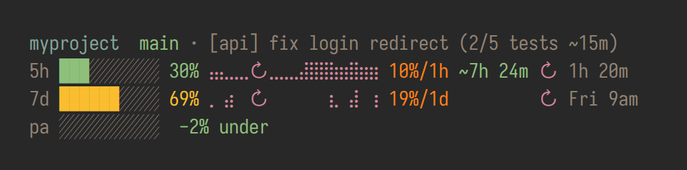
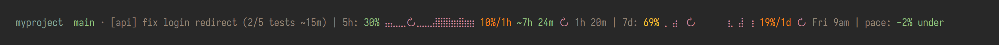
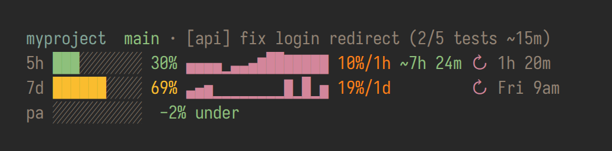
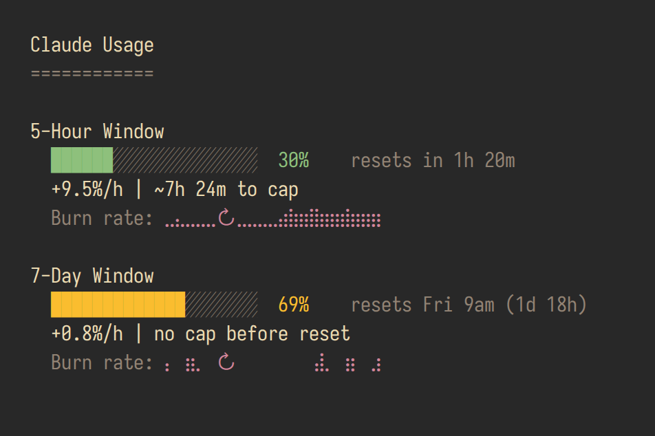
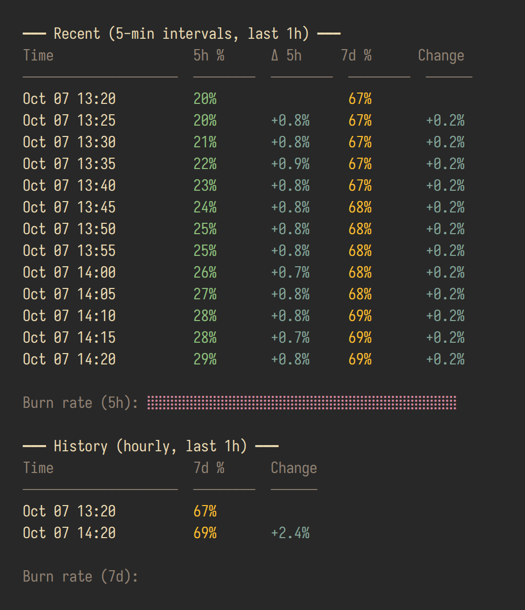

<p align="center">
  <code>claude-usage-statusline</code>
</p>

<p align="center">
  <strong>Know your Claude usage before you hit the wall.</strong>
</p>

<p align="center">
  <a href="https://github.com/meros/claude-usage-statusline/actions/workflows/ci.yml"></a>
  <a href="https://github.com/meros/claude-usage-statusline/blob/main/LICENSE"></a>
  <a href="https://github.com/meros/claude-usage-statusline"></a>
  <a href="https://github.com/meros/claude-usage-statusline/blob/main/flake.nix"></a>
</p>

<p align="center">
  <a href="#install">Install</a> •
  <a href="#set-up-claude-code">Claude Code</a> •
  <a href="#commands">Commands</a> •
  <a href="#how-it-works">How it works</a> •
  <a href="#configuration">Configuration</a> •
  <a href="#development">Development</a>
</p>

---

Claude Code tells you about your plan limits when you hit them. This puts the
5-hour and 7-day usage in your Claude Code statusline, together with how fast
you burn it, when you will reach 100% at that pace, and when the window resets.

<p align="center">
  
</p>

Reading the rows, left to right:

| Column | Example | Meaning |
|---|---|---|
| bar, percentage | `███░░░░░░░ 30%` | Usage of the window. Green below 50%, yellow below 80%, red above. |
| sparkline | `⣤⣄⣀⣀↻⣀⣀⣀⣼⣿⣿⣷` | Burn rate over the window (5 hours for 5h, 7 days for 7d). Each character is two time slots; height is how much usage grew in that slot. `↻` marks a reset. |
| rate | `10%/1h` | Usage burned in the last hour (5h) or day (7d). Red when the projection hits 100% before the reset. |
| ETA | `~7h 24m` | When you reach 100% at the current pace: a duration for 5h, a day and hour for 7d. Green when it is well after the reset, yellow when close, red before it. Hidden when you will not reach 100% before the reset. |
| reset | `↻ 1h 20m` | When the window resets. |
| `pa` row | `-2% under` | [Pacing](#pacing-the-work-week): 7-day usage against an even spread over your work week. |

The first line shows the directory, the git branch and, if you use it, a
[task label](#task-label) for the Claude session.

<details>
<summary>Single-line layout, block sparklines, dashboard and history</summary>

**Single line** (the default):



**Block sparklines** (`CU_SPARKLINE_TYPE=block`):



**Dashboard** (`claude-usage`):



**History** (`claude-usage history-view`):



</details>

All screenshots come from a fixed demo dataset (`scripts/screenshots.sh`).

## Install

Needs `bash` 4+, `jq`, `curl` and `awk` (and `git` for the clone install). `flock` (util-linux) is optional.

**Nix:**

```bash
nix profile install github:meros/claude-usage-statusline
```

**Git clone** (installs to `~/.local/share/claude-usage-statusline` and links
`~/.local/bin/claude-usage`):

```bash
curl -fsSL https://raw.githubusercontent.com/meros/claude-usage-statusline/main/install.sh | bash
```

<details>
<summary>Other Nix options</summary>

Run without installing:

```bash
nix run github:meros/claude-usage-statusline
```

Use it from a flake (the package, or `overlays.default` which adds
`pkgs.claude-usage-statusline`):

```nix
{
  inputs.claude-usage-statusline.url = "github:meros/claude-usage-statusline";
}
```

</details>

## Set up Claude Code

```bash
claude-usage install-hook --multiline
```

This sets `statusLine.command` in `~/.claude/settings.json` (or
`$CLAUDE_CONFIG_DIR/settings.json`) and keeps the rest of the file. Display
flags you pass (`--multiline`, `--windows`, `--modules`, `--sparkline-type`,
`--bar-width`) go into the command. Leave out `--multiline` for the single-line
layout. Restart Claude Code.

To configure it further, put `CU_*` variables in front of the command:

```json
{
  "statusLine": {
    "type": "command",
    "command": "CU_WINDOWS=seven_day CU_PACE_ENABLED=0 claude-usage statusline --multiline"
  }
}
```

## Commands

| Command | What it does |
|---|---|
| `claude-usage` / `show` | Dashboard: both windows, rate, projection and sparkline |
| `statusline` | Statusline output; reads Claude Code's session JSON on stdin |
| `eta` | Burn rate and time to 100% per window |
| `fetch` | Fetch from the API now, record history, prune old records |
| `history` | Raw JSONL history (`--tier short` or `--tier long`) |
| `history-view` (`hv`) | History tables with changes and sparklines (`--hours N`) |
| `sparkline` | A sparkline string only (`--tier`, `--hours`, `--width`, `--braille`) |
| `debug-template` (`dt`) | Trace the 7-day projection hour by hour |
| `install-hook` | Configure Claude Code (see above) |
| `help` | Commands and flags |

Flags for all commands: `--no-color`, `--no-fetch` (use the cache, no API
call), `--data-dir PATH`, `--cache-dir PATH`.

## How it works

### Where the numbers come from

1. **Claude Code's stdin.** Since v2.1.80, Claude Code passes `rate_limits`
   (5h and 7d used percentage and reset time) to the statusline command. When
   it is there, no network call happens.
2. **The OAuth usage API** (`api.anthropic.com/api/oauth/usage`), with the
   token Claude Code stores in `~/.claude/.credentials.json` or the macOS
   Keychain. Used only when stdin has no `rate_limits` (older Claude Code, the
   first render of a session, or the `show`/`eta`/`fetch` commands). The
   response is cached for 5 minutes, and parallel statuslines share one call
   (`flock`). The API rate-limits aggressively
   ([anthropics/claude-code#31637](https://github.com/anthropics/claude-code/issues/31637));
   on a rate-limit error it backs off 5, 10, 20, then 30 minutes and keeps
   showing the last data with a `(stale 1h 9m, retry 10m)` note.

With `ANTHROPIC_BASE_URL` set to a non-Anthropic endpoint (LiteLLM,
OpenRouter, ...) plan limits do not apply, and the statusline shows only the
directory and branch.

### History

Every render records a snapshot in two JSONL files:

| Tier | Interval | Kept | Contents | Used for |
|---|---|---|---|---|
| short | 5 minutes | 36 hours | 5h and 7d | burn rate, 5h sparkline |
| long | 1 hour | 1 year | 7d | 7d sparkline, seasonal projection |

History builds up as you use Claude Code; the rate and projections improve
after the first hours and days.

### Projections

- **Burn rate** is the usage added over the last `CU_ETA_5H_AVG` (1) or
  `CU_ETA_7D_AVG` (24) hours, divided by that many wall-clock hours. Drops
  (resets) never count as negative use, and idle time lowers the rate.
- **5h ETA** extrapolates that rate to 100%.
- **7d ETA** uses a seasonal template once there are 3 days of hourly history:
  for each hour of the week (Monday 10:00, Saturday 03:00, ...) it learns your
  average burn from the last 4 weeks, then walks forward hour by hour from now
  to the reset. Because weekly use follows work hours, this does not project a
  Tuesday-afternoon pace onto the weekend. Set `CU_ETA_TEMPLATE=0` to use the
  flat rate. `claude-usage debug-template` prints the learned profile and the
  walk.

### Pacing the work week

The `pa` row (or `| pace:` in single-line) compares 7-day usage with a target
that spreads the weekly cap evenly over your work hours:

```
target = 100% × (work hours of this week already passed / work hours per week)
```

With the default Monday-Friday 07-16, the target rises 2.2 points per work
hour and stays flat at night and on the weekend. `+12% over` means you are 12
points ahead of that curve; the bar fills at `CU_PACE_BAR_SCALE` (30) points
over. Set your own week with `CU_PACE_WORK_DAYS` and `CU_PACE_WORK_HOURS`, or
turn the row off with `CU_PACE_ENABLED=0`.

### Task label

The header can show a short label and progress for each Claude session, such
as `· [api] fix login redirect (2/5 tests ~15m)`. Something in your Claude Code
setup (a hook, a shell function) writes them; this tool only reads:

| File | First line |
|---|---|
| `$CU_TASK_STATE_DIR/pid-<PID>` | the label |
| `$CU_TASK_STATE_DIR/progress-<PID>` | the progress |

`<PID>` is the process ID of the `claude` process; the statusline finds it by
walking up its parent processes (Linux only). If `CU_TASK_HELPER` is
executable, the output of `$CU_TASK_HELPER summary` replaces the progress
file. Nothing shows when the files do not exist.

## Configuration

Every setting is an environment variable. Flags override them where a flag
exists.

### Layout

| Variable | Default | Description |
|---|---|---|
| `CU_WINDOWS` | `five_hour,seven_day` | Windows to show, in order (`--windows`) |
| `CU_MODULES` | see below | Modules per window, in order (`--modules`) |
| `CU_HEADER_MODULES` | `dir,branch,task` | Header parts; empty hides the header |
| `CU_SPARKLINE_TYPE` | `braille` | `braille` (2 slots per character) or `block` (`▁▂▃▄▅▆▇█`) |
| `CU_SPARKLINE_WIDTH` | `16` | Sparkline characters in the statusline |
| `CU_BAR_WIDTH` | `10` | Progress bar cells (`--bar-width`) |
| `CU_PCT_WARN` | `50` | Usage % where green turns yellow |
| `CU_PCT_CRIT` | `80` | Usage % where yellow turns red |

Modules: `bar` (multiline only), `pct`, `sparkline`, `rate`, `eta`, `reset`.
Defaults: `pct,sparkline,rate,eta,reset` (single-line) and
`bar,pct,sparkline,rate,eta,reset` (multiline).

### Projection and pacing

| Variable | Default | Description |
|---|---|---|
| `CU_ETA_5H_AVG` | `1` | Hours behind the 5h burn rate |
| `CU_ETA_7D_AVG` | `24` | Hours behind the 7d burn rate |
| `CU_ETA_TEMPLATE` | `1` | `0` uses the flat rate for the 7d ETA too |
| `CU_ETA_TEMPLATE_DAYS` | `28` | Days of history the 7d template learns from |
| `CU_ETA_TEMPLATE_MIN_DAYS` | `3` | Days of history needed before the template is used |
| `CU_PACE_ENABLED` | `1` | `0` hides the pacing row |
| `CU_PACE_WORK_DAYS` | `mon-fri` | Work days: `mon-thu`, `mon,wed,fri`, `1-5` (1 = Monday), ranges wrap (`sun-thu`) |
| `CU_PACE_WORK_HOURS` | `07-16` | Local work hours, `start-end`, end excluded |
| `CU_PACE_BAR_SCALE` | `30` | Points over target that fill the pacing bar |
| `CU_PACE_CONTRACT_PATH` | `~/.cache/claude-pacing/statusline.json` | Pacing from an external tool (`{"util", "target", "updated_at"}`), read only when no usage data exists |

### Colors

Values are ANSI SGR codes, for example `"38;2;255;0;0"` (24-bit red) or `"31"`.
`NO_COLOR` or `--no-color` turns colors off.

| Variable | Default | Used for |
|---|---|---|
| `CU_COLOR_SPARKLINE` | purple | Sparklines |
| `CU_COLOR_RATE` | orange | Burn rate |
| `CU_COLOR_ETA` | by margin | ETA; empty colors it red/yellow/green by its margin to the reset |
| `CU_COLOR_RESET` | dim | Reset time |
| `CU_COLOR_RESET_ICON` | purple | `↻` |
| `CU_COLOR_LABEL` | dim | `5h` / `7d` / `pa` labels, task label |
| `CU_COLOR_DIR` | aqua | Directory |
| `CU_COLOR_BRANCH` | green | Git branch |
| `CU_COLOR_WARN` | red | Rate when the cap comes before the reset |

### Data, network and the rest

| Variable | Default | Description |
|---|---|---|
| `CU_DATA_DIR` | `$XDG_DATA_HOME/claude-usage` | History files (`--data-dir`) |
| `CU_CACHE_DIR` | `$XDG_CACHE_HOME/claude-usage` | API cache, backoff, lock (`--cache-dir`) |
| `CU_CACHE_MAX_AGE` | `300` | Seconds before the API cache is refreshed |
| `CU_NO_LIMITS` / `CU_HIDE_LIMITS` | | `1` hides plan limits (as with a custom endpoint) |
| `CU_TASK_ENABLED` | `1` | `0` hides the task label |
| `CU_TASK_STATE_DIR` | `~/.local/state/claude-tasks` | Task label files |
| `CU_TASK_HELPER` | `~/.claude/hooks/claude-task.sh` | Optional progress helper |
| `CU_UPDATE_CHECK` | `1` | `0` turns off the "Update available" notice (git installs only; shown for 15 s at the start of a session) |
| `CU_UPDATE_TTL` | `3600` | Seconds between update checks |
| `CU_DEBUG` | | `1` logs to stderr, or to `CU_LOG_FILE` |

## Data files

| File | Contents |
|---|---|
| `$CU_DATA_DIR/history-short.jsonl` | 5-minute records, 36 hours |
| `$CU_DATA_DIR/history-long.jsonl` | Hourly 7d records, 1 year |
| `$CU_CACHE_DIR/api-response.json` | Last usage data; its mtime is the last refresh |
| `$CU_CACHE_DIR/rate-limit-backoff` | Current backoff in seconds, while backing off |

A record looks like
`{"ts":1791375600,"five_hour":{"util":30,"resets_at":"2026-10-07T13:40:00Z"},"seven_day":{...}}`.
Old single-file `history.jsonl` from earlier versions is migrated on first run
(backup: `history.jsonl.bak`).

## Troubleshooting

- **Nothing after the branch.** No usage data yet. Run `claude-usage fetch` and
  read its error. `No Claude credentials found` means you are not logged in to
  Claude Code with a subscription account.
- **`(stale …, retry …)`.** The API rate-limited the fetch. Recent Claude Code
  versions pass usage on stdin and do not need the API; update Claude Code.
- **Squares instead of sparklines.** Your terminal font has no
  braille characters. Use `CU_SPARKLINE_TYPE=block`.
- **Debug a render:** `echo '{"workspace":{"current_dir":"'$PWD'"}}' | CU_DEBUG=1 claude-usage statusline`

## Development

Pure bash, no build step. `bin/claude-usage` sources `lib/load.sh`, which loads
the modules in order:

| File | Responsibility |
|---|---|
| `lib/util.sh` | Paths, clock (`CU_NOW`), colors, formatting |
| `lib/config.sh` | `CU_*` defaults, window definitions, limit suppression |
| `lib/fetch.sh` | Token lookup, API fetch, backoff, cache, stdin `rate_limits` |
| `lib/history.sh` | Two-tier history: record, read, prune, migrate |
| `lib/eta.sh` | Burn rate, flat ETA, seasonal 7d template and its debug trace |
| `lib/render.sh` | Sparklines, bars, value formatting |
| `lib/pace.sh` | Work-week pacing |
| `lib/task.sh` | Session task label |
| `lib/update.sh` | Update notice |
| `lib/cli.sh` | Flags, subcommands, `help` |
| `views/*.sh` | Statusline, dashboard and history-view output |

```bash
bash tests/run-tests.sh            # every suite
bash tests/run-tests.sh fetch cli  # some suites
nix flake check                    # tests + shellcheck in the Nix sandbox
```

`tests/test-snapshots.sh` runs every view on a fixed demo dataset
(`tests/lib/demo.sh`) and compares the output, colors included, with
`tests/snapshots/`. After a deliberate output change, review and accept it:

```bash
UPDATE_SNAPSHOTS=1 bash tests/test-snapshots.sh && git diff tests/snapshots
```

`bash scripts/screenshots.sh` renders `docs/*.png` from the same dataset (needs
Nix for the font and Chrome or Chromium).

Issues and PRs welcome.

## License

[MIT](LICENSE)
